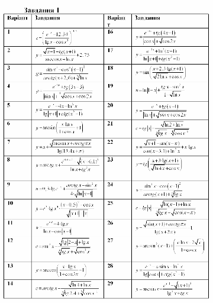

+++
draft = false
title = 'Лабораторна робота №2'
+++

## Тема
Використання операторів в Python. Оператори виразів.  
Пріоритет операцій. Функції в бібліотеці math.

## Мета роботи
Навчитися на практиці використовувати вбудовані оператори, розставляти пріоритети операцій і використовувати функції бібліотеки math в мові програмування Python.

---

## Теоретичні відомості

### Числа та операції над ними
Крім числових літералів, наведених в табл. 1.1, Python надає набір операцій для роботи з числовими об'єктами:

1. Оператори виразів +, -, *, /, >>, **, &, інші.  
2. Вбудовані математичні функції pow, abs, round, int, hex, bin, інші.  
3. Допоміжні модулі random, math, інші.  

Для роботи з числами в основному використовуються вирази, вбудовані функції і модулі (при цьому числа мають ряд власних, специфічних методів).

Дійсні числа, наприклад, мають метод as_integer_ratio, який зручно використовувати для перетворення дійсного числа в раціональне, а також метод is_integer_method, який перевіряє - чи можна подати дійсне число як ціле значення. Цілі числа теж мають різні атрибутами, включаючи метод bit length, він повертає кількість бітів, необхідних для подання значення числа.

Крім того, множини підтримують власні методи і оператори виразів.

При роботі з числами часто використовують вирази: комбінації чисел (або інших об'єктів) і операторів, які повертають значення при виконанні інтерпретатором Python. Вирази в Python записуються з використанням звичайної математичної нотації і символів операторів. Наприклад, складання двох чисел X і Y записується у вигляді виразу X+Y, яке наказує інтерпретатору Python застосувати оператор «+» до значень з іменами X і Y. Результатом виразу X+Y буде інший числовий об'єкт.

У табл. 1.1 наведено перелік всіх операторів, наявних в Python (математичні оператори: +, -, *, / і т. д.; оператор % обчислює залишок від ділення, оператор «<<» виконує побітовий зсув вліво, оператор «&» виконує побітову операцію «і» і т. д.).

Деякі оператори більш характерні для Python. Наприклад, оператор «is» перевіряє ідентичність об'єктів, оператор lambda створює неіменовані функції. Нерівність значень можна перевірити як X! = Y. Операція ділення з округленням вниз (X//Y) усікає дробову частину. Операція ділення X / Y виконує справжнє ділення (повертає результат з дробовою частиною).

---

## Таблиця 1.1  
Оператори виразів в Python і правила визначення старшинства

| Оператори | Опис |
|----------|------|
| yield x | Підтримка протоколу send у функціях - генераторах |
| lambda args: expression | Створює анонімну функцію |
| x if y else z | Тримісний оператор вибору (значення x обчислюється, тільки якщо значення y істинно) |
| x or y | Логічна операція «АБО» (значення y обчислюється, тільки якщо значення x = хибність) |
| x and y | Логічний оператор «І» (значення y обчислюється, тільки якщо значення x = істина) |
| not x | логічне заперечення |
| x in y, x not in y | Перевірка на входження (для ітерованих множин) |
| x is y, x is not y | Перевірка ідентичності об'єктів |
| x < y, x <= y, x > y, x >= y, x == y, x != y | Оператори порівняння |
| x \| y | Бітова операція «АБО», об'єднання множин |
| x ^ y | Бітова операція «виключне АБО» (XOR), симетрична різниця множин |
| x & y | Бітова операція «І», перетин множин |
| x << y, x >> y | Зсув значення x вліво або вправо на y бітів |
| x + y | Додавання, конкатенація |
| x - y | Віднімання, різниця множин |
| x * y | Множення, повторення |
| x % y | Залишок, формат |
| x / y | Ділення: справжнє |
| x // y | Ділення: з округленням вниз |
| -x | Унарний знак «мінус» |
| ~x | Бітова операція «НЕ» (інверсія) |
| x ** y | Піднесення до степеню |
| x[i] | Індексація |
| x[i:j:k] | витяг зрізу |
| x(...) | Виклик |
| x.attr | Звернення до атрибуту |
| (...) | Кортеж, підвираз |
| [.] | Список |
| {...} | Словник, множина |

---

## Таблиця 1.2  
Функції в бібліотеці math

| Назва функції | Призначення функції |
|--------------|-------------------|
| math.ceil(x) | Округлення вгору |
| math.copysign(x, y) | Повертає число x зі знаком y |
| math.fabs(x) | Модуль числа (float) |
| math.factorial(x) | Факторіал |
| math.floor(x) | Округлення вниз |
| math.fmod(x, y) | Остача для float |
| math.frexp(x) | Представлення x = m*2^e |
| math.fsum(iterable) | Сума елементів |
| math.isinf(x) | Перевірка на нескінченність |
| math.isnan(x) | Перевірка на NaN |
| math.ldexp(x, i) | x * 2^i |

---

## Введення та виведення даних
Введення даних з клавіатури в програму (починаючи з версії Python 3.0) здійснюється за допомогою функції input ().

Коли дана функція виконується, то потік виконання програми зупиняється в очікуванні даних, які користувач повинен ввести за допомогою клавіатури. Після введення даних і натискання Enter, функція input () завершує своє виконання і повертає результат, який представляє собою рядок символів, введених користувачем.

Функція input () може приймати необов'язковий аргумент-запрошення рядкового типу; при виконанні функції повідомлення буде з'являтися на екрані.

### Приклад
```Python
from math import *
a = 1
b = 2
x = sqrt(ab)/(exp(a)b)+aexp((2a)/b)
print(x)
```

---

Завдання 1: В завданні кожного варіанту необхідно обчислити значення виразу та вивести його на екран. Номер варіанту завдання співпадає з номером у журналі.



---

## Контрольні запитання

1. Які особливості та переваги мови Python Ви знаєте?  
2. Назвіть основні принципи синтаксису мови Python.  
3. Як здійснюється введення/виведення даних у мові Python?  
4. Назвіть основні тип даних в Python.  
5. Як можна обміняти значеннями дві змінні в Python?  
6. Яка функція приводить змінну до рядкового типу?  
7. Що означає NаN?  
8. В якій бібліотеці містяться стандартні математичні функції?  
9. Назвіть парадигми програмування, які підтримує Python.  
10. Яке призначення функції bool?

## [Перевірити знання](../../tests/lab2/test.html)
