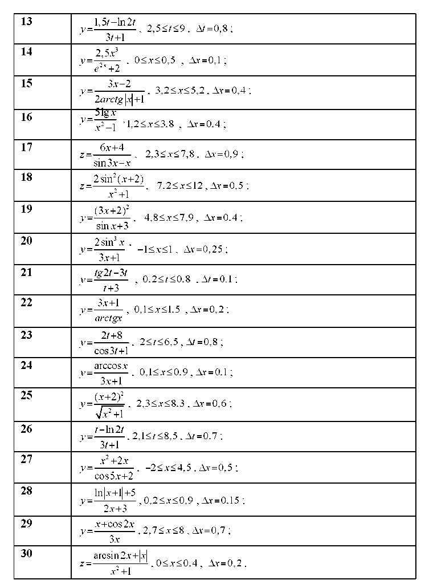

+++
title = "Лабораторна робота №4"
+++

### Тема 
Організація циклічних процесів в Python. Оператор циклу з передумовою 'while', оператори 'break', 'continue', 'pass' і 'else'

## Мета роботи
Навчитися створювати найпростіші програми на мові Python, використовуючи оператори циклу з передумовою та арифметичні вирази.

---

## Теоретичні відомості

### Цикл і його властивості

Алгоритм з неодноразовим виконанням певної послідовності дій — це **циклічний алгоритм**. Блок повторюваних операторів називають **тілом циклу**. Циклічний процес, де кількість повторень заздалегідь невідома, називається **ітераційним**.

Для всіх циклів характерно:

- Повторювані обчислення записуються лише один раз
- Вхід у цикл можливий тільки через його початок
- Змінні циклу мають бути визначені до входу в нього
- Обов'язково потрібно передбачити вихід із циклу

> **Нескінченний цикл** — циклічна ділянка без засобів виходу. Щоб зупинити виконання, натисніть `Ctrl+C`.

---

### Інструкція 'while'

Організує цикл з **передумовою** — перевірка виконується перед кожною ітерацією. Складається з рядка заголовка, тіла циклу та необов'язкової частини `else`.

```python
while <test>:          # умовний вираз
    <statements1>      # тіло циклу
else:                  # необов'язкова частина
    <statements2>      # виконується, якщо вихід не через break
```

Інтерпретатор продовжує обчислювати умовний вираз і виконувати тіло циклу, поки умова не поверне `False`.

---

### 'break' — вихід із циклу

Виконує негайний перехід за межі циклу. Код після `break` не виконується.

```python
while 1:
    name = input('Enter name: ')
    if name == 'stop':
        break
    age = input('Enter age: ')
    print('Hello', name, '=>', int(age) ** 2)
```

---

### 'continue' — перехід на початок циклу

Пропускає залишок тіла циклу і переходить до наступної ітерації. Приклад — виводить парні числа менше 10:

```python
x = 10
while x:
    x = x - 1
    if x % 2 != 0: continue  # непарне — пропустити
    print(x, end=' ')         # виводить: 8 6 4 2 0
```

---

### 'pass' — пуста інструкція

Нічого не виконує. Використовується як заповнювач там, де синтаксис вимагає наявності інструкції.

```python
while 1:
    pass   # або ... (три крапки в Python 3)
```

---

### 'else' — блок після нормального завершення

Виконується лише якщо цикл завершився **без** `break`. Приклад — перевірка простого числа:

```python
y = 5
x = y // 2
while x > 1:
    if y % x == 0:
        print(y, 'has factor', x)
        break
    else:
        x -= 1
else:
    print(y, 'is prime')
```

---

## Хід роботи

### Завдання 1

Обчислити значення виразу та вивести на екран. Ввести початкове значення `X`, організувати цикл до кінцевого значення так, щоб `X` змінювалось на `ΔX` при кожній ітерації. Розрахувати функцію `Y(x)`.



> **Номер варіанту завдання співпадає з номером у журналі.**

### Завдання 2

Протабулювати функцію `Y(x)` з попереднього завдання. Вивести таблицю значень у форматі `X | Y(X)` — розрахувати значення для кожного `X` і вивести на екран.

---

## Контрольні запитання

1. Що таке цикл, для чого його використовують?
2. Як описується та виконується циклічна інструкція `while`?
3. Як можна організувати нескінченні цикли? Наведіть декілька прикладів і поясніть їх.
4. Як можна вийти з нескінченних циклів?
5. Чи може оператор циклу не мати тіла? Чому?
6. Для чого служить оператор переривання `break`?
7. Для чого служить оператор `continue`?


## [Перевірити знання](../../tests/lab4/test.html)
