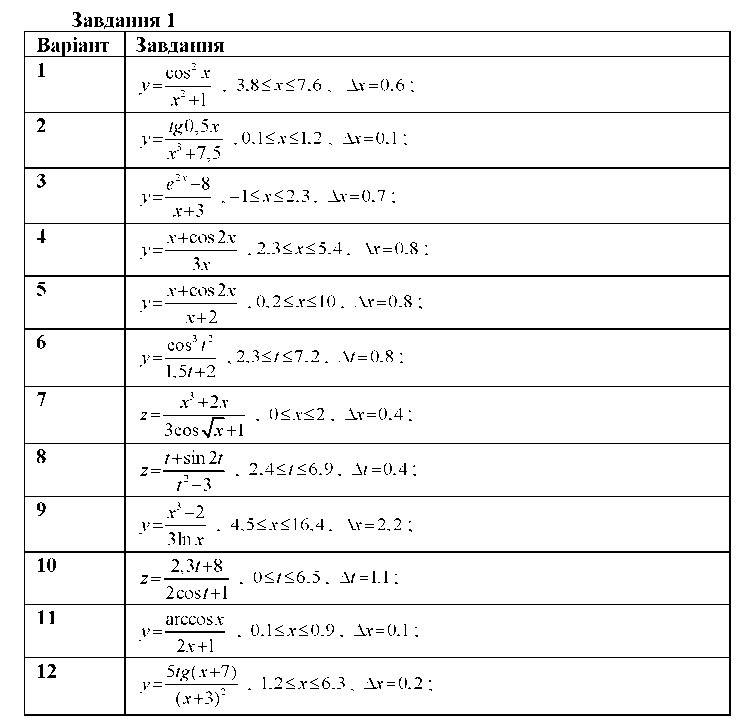

+++
title = "Лабораторна робота №5"
+++

### Тема: Організація циклічних процесів в Python. Оператор циклу з параметром for. Оператори range(),enumerate(),zip().

---

## Мета роботи

Навчитися створювати найпростіші програми на мові Python, використовуючи оператори циклу з параметром, арифметичні вирази.

---

## Теоретичні відомості

### Цикл 'for' 
Цикл for − універсальний ітератор послідовностей: він може виконувати обхід елементів в будь−яких впорядкованих об&#39;єктах−послідовностях.
Інструкція for здатна обробляти рядки, списки, кортежі, інші вбудовані об&#39;єкти, які підтримують можливість виконання ітерацій. Цикли `for` в Python розпочинають з рядка заголовка, де вказують змінну циклу для присвоювання, а також об&#39;єкт, обхід якого буде виконано. За заголовком розташовано блок (зазвичай з відступами) інструкцій, які потрібно виконати:
```Python
for <target> in <object>
    <Statements>
else:
    <Statements>
```

Коли інтерпретатор виконує цикл for, він по черзі присвоює змінній циклу елементи об'єкта−послідовності і виконує оператори з тіла циклу для кожного елементу. Змінну циклу можна змінити в тілі циклу, проте їй автоматично буде присвоєно наступний елемент послідовності, коли управління повернеться на початок циклу. Після виходу з циклу ця змінна зазвичай посилається на останній елемент послідовності (якщо цикл не був завершений інструкцією break). Інструкція for підтримує необов'язкову частина else, яка працює так само, як і в циклах while − її виконують, якщо вихід з циклу реалізовано не інструкцією break (тобто, якщо в циклі не виконано обхід всіх елементів послідовності). Інструкції break і continue в циклах for працюють так само, як і у циклах while.
Повна форма циклу for має такий вигляд:
```Python
for <target> in <object>:
    <Statements>
    if <test>: break # Вихід з циклу, минаючи блок 'else'
    if <test>: continue # Перехід на початок циклу
    else: <Statements> # Якщо не викликано 'break'
```

---

## Хід роботи

### Завдання 1
В завданні кожного варіанту необхідно обчислити значення виразу за допомогою оператору for та вивести його на екран. В програмі треба ввести початкове значення Х, організувати цикл до кінцевого значення, при проходженні однієї ітерації щоб значення Х змінювалось на Х. Таким чином розрахувати функцію У(х). Номер варіанту завдання співпадає з номером у журналі.




> **Номер варіанту завдання співпадає з номером у журналі.**

### Завдання 2

Знайти суму ряду, використовуючи цикл for. Для початкового значення параметру циклу береться х з таблиці, для кінцевого – n. Крок виконання циклу – 1. Всі проміжні значення f1(x)/f2(x) сумуються між собою, результатом має бути сума всіх f1(x)/f2(x) які приймає х за вашим варіантом. Номер варіанту співпадає ї номером по журналу.


| Номер варіанту |  Знайти суму ряду  x=хnf1(x)f2(x)  |  |  |  |
| :---- | ----- | :---- | :---- | :---- |
|  | **F1(x)** | **F2(x)** | **x** | **n** |
| *1,16* | x+1 | 3√x+1 | 2.5 | 22 |
| *2,17* | x | (2x+1)  | 1.2 | 20 |
| *3,18* | x2 | x(x+1) | 0.7 | 26 |
| *4,19* | cos(2x) | (2x-1)(2x+1) | 1.8 | 18 |
| *5,20* | sin(x) | x2\+2x+3 | 2.6 | 24 |
| *6,21* | ex | (2x+1)(x+1)2 | 3.7 | 16 |
| *7,22* | e2x | (x+1)(x+2) | 3.4 | 26 |
| *8,23* |  Tg(x) | 1+x  | 3.2 | 20 |
| *9,24* | (x+10) | √lnx2 | 1.8 | 28 |
| *10,25* | sin(5x) | √1+ex | 1.7 | 24 |
| *11,26* | cos(3x2) |  √5x+ex | 2.7 | 24 |
| *12,27* | (-2x)3 | x\!  | 2.2 | 22 |
| *13,28* | x | x\!  | 0.5 | 18 |
| *14,29* |  √lnx | x\! | 2.1 | 24 |
| *15,30* | 3√x | (2x+1)2 | 0.8 | 18 |


### Завдання 3
Знайти значення функції, використовуючи цикл for. Для початкового значення параметру циклу береться А з таблиці, для кінцевого – В. Крок виконання циклу – Н. Номер варіанту співпадає ї номером по журналу.

| Номер варіан-ту | Функція | А | В | H | Номер варіанту | Функція | A | B | H |
| ----- | ----- | ----- | ----- | ----- | ----- | ----- | ----- | ----- | ----- |
| *1,15* | Ln2x | 1.3 | 6.5 | 0.5 | *8,22* | √x2\+5 | 1.6 | 4.8 | 0.8 |
| *2,16* | Sin2x+1 | 1.2 | 3.6 | 0.2 | *9,23* | Sin2x | 1.6 | 2.8 | 0.9 |
| *3,17* | Ex\+5 | 1.4 | 4.2 | 1.3 | *10,24* | Ln3x | 0.2 | 0.8 | 0.04 |
| *4,18* | Arctg2x | 0.02 | 0.4 | 0.3 | *11,25* | √lnx2 | 0.2 | 0.8 | 0.01 |
| *5,19* | √|lnx| | 0.5 | 4.6 | 0.5 | *12,26* | Lgx2 | 0.1 | 0.6 | 0.04 |
| *6,20* | Cos 3x | 0.7 | 1.8 | 0.2 | *13,27* | √cosx+sinx | 0.4 | 0.9 | 0.02 |
| *7,21* | 3√x | 5 | 25 | 1.25 | *14,28* | √1+ex | 0.3 | 0.9 | 0.05 |

**Контрольні запитання:**

1. Що таке цикл, для чого його використовують.  
2. Як описується та виконується циклічна інструкція while?  
3. Як можна організувати нескінченні цикли? Наведіть декілька прикладів і поясніть їх.  
4. Як можна вийти з нескінченних циклів?  
5. Чи може оператор циклу не мати тіла? Чому?  
6. Для чого служить оператор переривання break та continue?  
7. Для чого служить оператор continue?
## [Перевірити знання](../../tests/lab5/test.html)
