## План:
1. Поняття двовимірного масиву  
2. Створення двовимірного списку  
2.1 Створення порожнього списку а з 3 рядків  
2.2 Введення за допомогою генератору  
2.3 Уведення  значень двовимірного масиву з клавіатури  
2.4 Заповнення двовимірного масиву випадковими числами  
2.5 Надання значень елементам масиву за формулою  
3. Приклади використання  

---

## 1. Поняття двовимірного масиву

<iframe width="560" height="315" src="https://www.youtube.com/embed/JgFVgMS_JFM?si=w9EsE_-ZoJqD1IAC" title="YouTube video player" frameborder="0" allow="accelerometer; autoplay; clipboard-write; encrypted-media; gyroscope; picture-in-picture; web-share" referrerpolicy="strict-origin-when-cross-origin" allowfullscreen></iframe>

Одновимірний масив можна уявити як таблицю, що містить один рядок або стовпець даних. Однак нам часто доводиться працювати з таблицями, у яких кілька рядків і кілька стовпців. Для опрацювання даних таких таблиць зручно використовувати двовимірний масив. Кожний елемент такого масиву визначається двома індексами.

**Двовимірний масив** — таблиця з `n` рядків, `m` стовпців.

Масив називається двовимірним, якщо для задання місцеположення елемента в масиві необхідно вказати значення двох індексів.

У мові Python для  опрацювання двовимірних масивів використовуються двовимірні списки, тобто списки, кожен елемент яких є списком значень.

*Приклад:  
Збережемо дані таблиці, поданої на рисунку, у змінній `а`.*

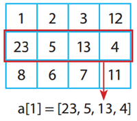

```python 
a = [[1, 2, 3, 12], [23, 45, 13, 4], [8, 6, 7, 11]]
```

Кожний елемент двовимірного списку а також є списком, що містить дані з одного рядка таблиці. Довжина списку `len(a) = 3`.

Звернутися до елемента двовимірного списку (рядка таблиці) можна за його індексом: 

```python
a[0] = [1, 2, 3, 12].
```

Для перебору рядків списку використовується цикл `for`.


Можна перебрати індекси вкладених списків — елементів двовимірного списку . 

```python
 for i in range (len(a)):
        print(a[i])
```

Можна перебрати всі наявні у двовимірному  списку елементи — рядки таблиці.

```python
 for row in a:
        print(row)
```

При використанні обох варіантів циклу в консоль буде виведено наведене на рисунку:
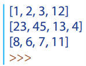 
Положення елемента в таблиці визначається 2 індексами — номером рядка і номером стовпця, отже для доступу до елемента у вкладеному списку  слід указати два індекси.
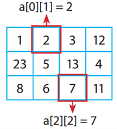 
Елемент, розташований на перетині `і-го рядка` і `j-го стовпця` масиву `a`, позначають `a[і][j]`.

У двовимірних масивах перший індекс завжди вказує на номер рядка, а другий — на номер стовпця таблиці.

Послідовно отримати доступ до кожного елемента двовимірного масиву можна за допомогою вкладених циклів: зовнішній цикл перебирає вкладені списки (рядки таблиці), внутрішній цикл перебирає елементи рядка.

*Приклад:  
Виведення значень списку а в консоль порядково:*
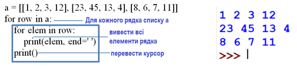
*параметр end=' ' метода print() потрібен, щоб після виведення курсор залишився в тому самому рядку. Оператор print() з порожнім списком виведення переводить курсор на наступний рядок.*

---

## 2. Створення двовимірного списку для зберігання масиву з n рядків та m стовпців

### 2.1 Створення порожнього списку а з 3 рядків: 

```python
a = [[], [], []]
```

Нехай потрібно створити список для збереження даних прямокутної таблиці, у якій `n` рядків і `m` стовпців, і заповнити його нулями.

Це можна зробити в такий спосіб:

```python
n, m = 3, 4
a = [] # Створюємо порожній список
for i in range(n): # Додаємо n елементів
          a.append([0]*m) # Кожен елемент — список з m нулів
```
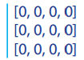

### 2.2 Введення за допомогою генератору

Двовимірний масив можна створити з використанням генератора. Список `[0]*m` заново генерується для заповнення чергового елемента списку `а`.

```python
a = [list(input().split()) for i in range(n)]
```

### 2.3 Уведення  значень двовимірного масиву з клавіатури

Щоб заповнити двовимірний список цілими значеннями елементів двовимірного масиву з `n` рядків і `m` стовпців, уводячи значення елементів з клавіатури, слід `n` разів виконати дії:

1) увести рядок `s`, що містить m чисел, відокремлених пробілами, і розбити рядок `s` функцією `split()` на підрядки;  

2) функцією `map()` кожний підрядок рядка `s` перетворити на числовий тип;  

3) функцією `list()` отриману послідовність перетворити у список `row`;  

4) список `row` додати до списку `а`.

```python
n = int(input()) # Кількість рядків масиву
a = [] # Створюється порожній список
for i in range(n):
    s= input().split()
    row=list(map(int, s))
    a.append(row)
```

### 2.4 Заповнення двовимірного масиву випадковими числами

Заповнимо двовимірний список випадковими значеннями елементів двовимірного масиву з `n` рядків і `m` стовпців:

```python
from random import randint
n, m=3, 4
a = [[] for i in range(n)]
for i in range(n):
            for j in range(m):
                         a[i] .append(randint(1,10)) # Додавання чергового елемента до і-го рядка
print (a)
```

*Результат виведення списку а в консоль може бути таким:*

```python
[[7, 4, 4, 2], [10, 9, 1, 10], [6, 7, 2, 2]]
```

### 2.5 Надання значень елементам двовимірного масиву за формулою

Задання значень елементів двовимірного масиву за певною формулою має місце у випадках, коли значення елемента залежить від його індексів.   

### 3 Приклади використання двовимірних масивів

Заповнимо вкладений список а елементами таблиці Піфагора:
                           |
:-------------------------:|:-------------------------:
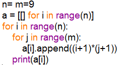                 | 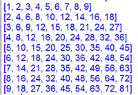 

Нехай кожний елемент масиву 5х5 дорівнює більшому з його індексів:
                           |
:-------------------------:|:-------------------------:
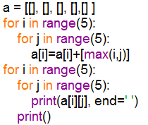                 | 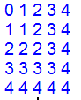

Заповнимо двовимірний масив 5 × 5 у такий спосіб:  
•	елементам головної діагоналі присвоїти значення 1,  
•	елементам, що розташовані вище головної діагоналі, — значення 2,  
•	елементам, що розташовані нижче головної діагоналі, — значення 0.   
                           |
:-------------------------:|:-------------------------:
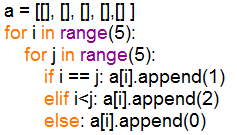                | 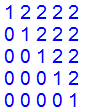


